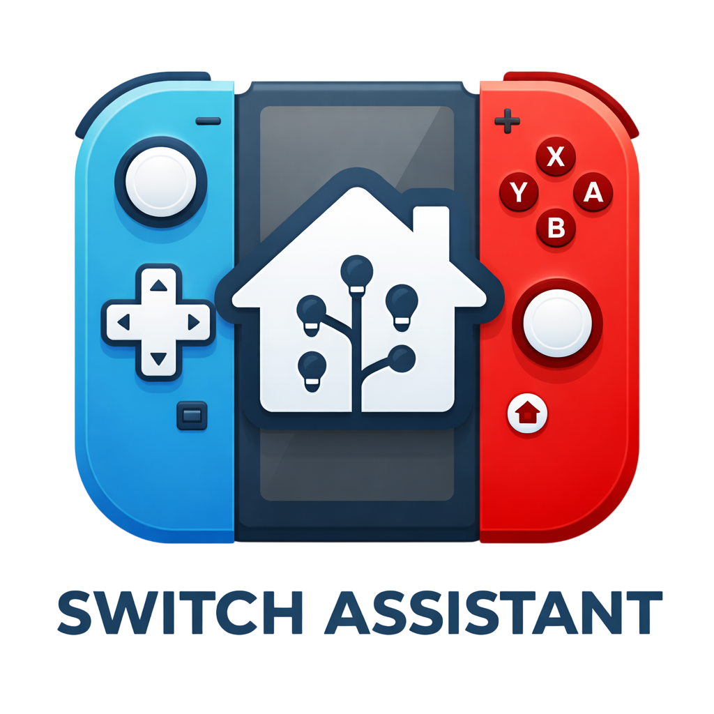
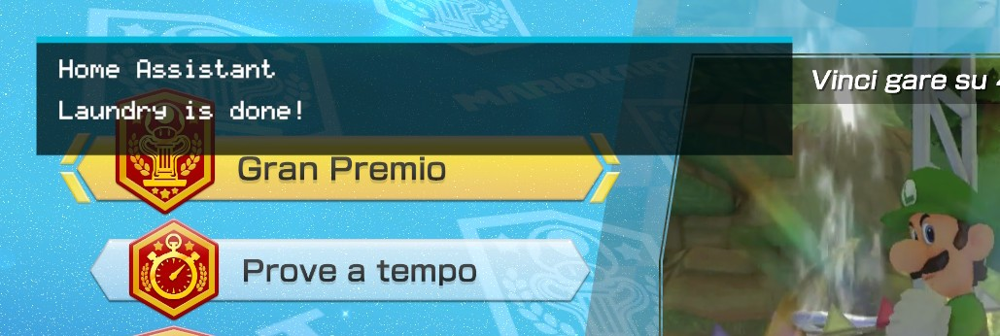

# Switch Assistant

<p align="center">
  
</p>

<p align="center">
  <a href="https://github.com/ErSeraph/switch-assistant/releases"></a>
  
  
</p>

Switch Assistant connects your Nintendo Switch to Home Assistant through MQTT.

Once configured, it publishes console sensors to Home Assistant and shows Home Assistant popup notifications directly over your game, without opening Tesla Menu.

## What It Does

- Shows battery, charging state, temperature, brightness, volume, and connected controllers in Home Assistant.
- Reports whether a game is running and publishes the current game Title ID.
- Exposes reboot and shutdown buttons in Home Assistant.
- Sends Home Assistant popup notifications to the Switch.
- Provides a simple Homebrew configuration app on the console.
- Uses MQTT Discovery so entities appear automatically in Home Assistant.

## How It Works

The project installs three components:

| Component | Purpose |
| --- | --- |
| `switch-ha.nro` | Homebrew app used for configuration, connection tests, and automatic installation. |
| Atmosphere sysmodule | Background process that publishes sensors and receives MQTT commands. |
| Notification overlay | Shows Home Assistant popups over the currently running game. |

The `.nro` app is only used for setup and configuration. After rebooting, the sysmodule handles the background MQTT work.

## Requirements

- Nintendo Switch running Atmosphere.
- Working Homebrew Menu.
- Home Assistant already installed.
- An MQTT broker reachable from the Switch, such as Mosquitto.
- A network where the Switch and MQTT broker can communicate with each other.

> Important: the sysmodule supports plain TCP MQTT, usually on port `1883`. It does not support TLS on `8883`, MQTT over WebSocket, or mDNS hostnames such as `homeassistant.local` for the MQTT broker.

## Quick Installation

1. Download `switch-ha.nro` from the latest [release](https://github.com/ErSeraph/switch-assistant/releases).
2. Copy the file to your SD card:

   ```text
   sdmc:/switch/switch-ha/switch-ha.nro
   ```

3. Launch `Switch Assistant` from the Homebrew Menu.
4. On first launch, the app creates the required folders and installs:

   ```text
   sdmc:/atmosphere/contents/00FF000053484101
   sdmc:/atmosphere/contents/00FF000053484102
   sdmc:/switch/switch-ha/switch-ha-overlay.ovl
   sdmc:/switch/switch-ha/config.ini
   ```

5. Enter your Home Assistant and MQTT settings.
6. Press `Y` to test the connection.
7. Press `-` to reboot the console.

After the reboot, Home Assistant should automatically discover the new MQTT entities.

## Configuration On The Switch

On the main screen:

| Button | Action |
| --- | --- |
| `D-Pad` | Select a field. |
| `A` | Edit the selected field. |
| `Y` | Test Home Assistant and MQTT. |
| `-` | Reboot the console to apply changes. |
| `+` | Exit the app. |

Fields to fill in:

| Field | Example | Notes |
| --- | --- | --- |
| `HA URL` | `http://192.168.1.10:8123` | Your Home Assistant URL. |
| `HA Token` | long-lived token | Your Home Assistant long-lived access token. |
| `MQTT Host IP` | `192.168.1.10` | Use the broker IP address, not `homeassistant.local`. |
| `MQTT Port` | `1883` | Do not use `8123`: that is the Home Assistant web port. |
| `MQTT Username` | `mqtt_user` | MQTT broker username. |
| `MQTT Password` | `password` | MQTT broker password. |
| `Discovery` | `homeassistant` | Standard MQTT Discovery prefix. |
| `Name` | `Nintendo Switch` | Device name shown in Home Assistant. |
| `Client ID` | `switch-ha-xxxxxxxx` | Generated automatically, editable if needed. |

The Home Assistant token can be long. If entering it on the console is inconvenient, open the app once, then edit this file from your PC:

```text
sdmc:/switch/switch-ha/config.ini
```

After changing any configuration value, reboot the console so the sysmodule reloads the file.

## Create A Home Assistant Token

1. Open Home Assistant.
2. Open your user profile.
3. Scroll down to **Long-lived access tokens**.
4. Create a new token.
5. Copy it into the `HA Token` field or into `config.ini`.

## MQTT In Home Assistant

With MQTT Discovery enabled, Switch Assistant publishes discovery payloads under the configured prefix, usually:

```text
homeassistant
```

Console states are published under:

```text
switch_ha/<client_id>/...
```

Main entities:

| Type | Entities |
| --- | --- |
| Battery sensors | level, charging state, charger type, voltage, temperature, battery health |
| Console sensors | brightness, screen, volume, audio output target |
| Game | game running, current Title ID |
| Controllers | player count, Player 1-8 controller type |
| Commands | reboot, shutdown |
| Notifications | Home Assistant popup on the Switch |

## Send A Notification To The Switch

<p align="center">
  
</p>

Home Assistant creates a notify entity with a name similar to:

```text
notify.nintendo_switch_popup_notification
```

Example Home Assistant action:

```yaml
action: notify.send_message
target:
  entity_id: notify.nintendo_switch_popup_notification
data:
  message: "Laundry finished"
```

You can also send a title and message:

```yaml
action: notify.send_message
target:
  entity_id: notify.nintendo_switch_popup_notification
data:
  title: "Home Assistant"
  message: "The washing machine has finished"
```

The sysmodule writes the latest notification here:

```text
sdmc:/switch/switch-ha/notification-current.ini
```

and keeps a small log here:

```text
sdmc:/switch/switch-ha/notifications.log
```

The overlay reads these files and shows the popup automatically.

## Troubleshooting

### Home Assistant does not show any entities

- Make sure the MQTT integration is enabled in Home Assistant.
- Check that `Discovery` is set to `homeassistant`.
- Press `Y` in the app and confirm that the MQTT test succeeds.
- Reboot the console after saving the configuration.

### Wrong MQTT port

If you see a message like:

```text
Port 8123 is HA HTTP; MQTT is usually 1883
```

you are using the Home Assistant web port. MQTT usually runs on `1883`.

### TCP failed or broker/port closed

The Switch reached the broker IP, but the MQTT port is closed or not exposed.

Check that:

- Mosquitto or your MQTT broker is running.
- Port `1883` is exposed on your LAN.
- Firewall, VLAN, or client isolation rules are not blocking the Switch.
- The configured IP address is the MQTT broker address.

### The test works, but sensors do not appear

The test runs from the `.nro` app. Sensors are published by the sysmodule only after rebooting.

Press `-` in the app or reboot the console manually.

### Notifications do not appear

- Make sure the notify entity exists in Home Assistant.
- Send a test notification from Home Assistant.
- Check that `notification-current.ini` is updated.
- Reboot the console to make sure the overlay loader and overlay are running.

## Build From Source

Requirement:

- Docker Desktop installed and running.

From Windows:

```bat
scripts\build-docker.bat
```

The script:

- pulls `devkitpro/devkita64` if needed;
- builds the sysmodule;
- builds the notification overlay;
- builds the notification overlay loader;
- embeds the sysmodule and overlay into the app romfs;
- generates `switch-ha.nro`.

## Useful Paths

| Path | Contents |
| --- | --- |
| `sdmc:/switch/switch-ha/switch-ha.nro` | Homebrew app. |
| `sdmc:/switch/switch-ha/config.ini` | Configuration. |
| `sdmc:/switch/switch-ha/switch-ha-overlay.ovl` | Notification overlay. |
| `sdmc:/switch/switch-ha/sysmodule.log` | Sysmodule log. |
| `sdmc:/switch/switch-ha/sysmodule-heartbeat.txt` | Sysmodule diagnostic state. |
| `sdmc:/switch/switch-ha/notifications.log` | Short notification history. |
| `sdmc:/atmosphere/contents/00FF000053484101` | Switch Assistant sysmodule. |
| `sdmc:/atmosphere/contents/00FF000053484102` | Switch Assistant overlay loader. |

## Credits

The overlay loader is derived from the ISC-licensed `nx-ovlloader` project and chainloads the Switch Assistant overlay directly instead of Tesla Menu.

## License

Switch Assistant is licensed under the [MIT License](LICENSE).

The overlay loader includes code derived from `nx-ovlloader`, which is licensed under the ISC License.
